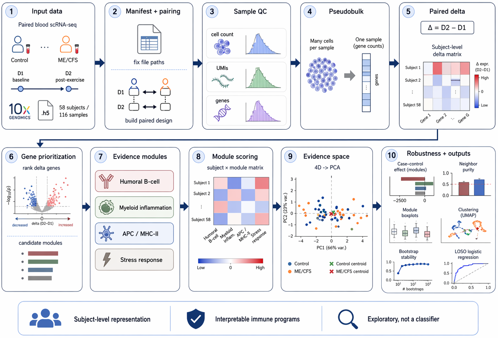

# DeltaMap: A Paired scRNA-seq Evidence Representation Pipeline for Longitudinal Immune-State Analysis

A reproducible pipeline for constructing subject-level immune-state evidence representations from paired longitudinal single-cell RNA-seq data. Demonstrated on ME/CFS peripheral blood scRNA-seq (GSE214284, 58 subjects).

This work is a prototype front-end layer for a larger Evidence Foundation Model (EvidenceFM) concept. Rather than treating scRNA-seq as a classification input, we ask what structured, interpretable, low-dimensional representation can be built at the subject level from temporal immune change signals. See [DESIGN.md](DESIGN.md) for the broader architectural vision.


## Background

Standard scRNA-seq analysis operates at the cell or sample level. For longitudinal disease cohorts with paired time points, there is an opportunity to define a richer unit of analysis: the within-subject temporal change (D2 minus D1), aggregated into a stable, interpretable evidence vector per subject.

This pipeline converts raw 10x Chromium `.h5` files into a pseudobulk delta matrix (per-subject D2 minus D1 gene expression change), a set of evidence modules (biologically coherent gene programs whose cross-subject co-variation captures the dominant immune state axes), and a low-dimensional evidence space (4D module scores projected to 2D PCA) with subject-level geometry and neighbor structure.

Applied here to GSE214284: 58 ME/CFS subjects, 30 case and 28 control, 116 samples total, paired blood scRNA-seq.


## Key Findings (GSE214284)

Four evidence modules emerge stably from the paired-delta signal:

| Module | Representative genes |
|--------|----------------------|
| Humoral B-cell | IGKC, IGHM, IGHA1, IGLC1/2/3, JCHAIN |
| Myeloid inflammation | S100A8, S100A9, S100A12, LYZ, VCAN, CD14 |
| APC / MHC-II | CD74, HLA-DRA, HLA-DPA1, HLA-DRB1, CST3 |
| Stress response | NFKBIA, NFKBIZ, ZFP36, DUSP1, GADD45B, FOSB |

The dominant pattern in ME/CFS cases is not selective pathway activation but coordinated attenuation across all four modules, with the strongest reduction in humoral B-cell signals. The evidence space shows continuous immune-state variation rather than two separable clusters, suggesting the cohort is better modeled as a spectrum of immune response states than a binary case/control dichotomy.

Note on classification performance: leave-one-out logistic regression on the module scores does not yield meaningful case/control discrimination (AUC approximately 0.26 on this single cohort). This is consistent with the observed intermixed geometry of the evidence space and the small sample size. The pipeline is intentionally not framed as a classifier; it is a representation and discovery tool.


## Pipeline Overview



```
raw 10x .h5 files
       |
  00   Fix raw file paths in manifest
       |
  01   Build paired D1/D2 design table with file paths
       |
  02   Sample-level QC (cell count, mean counts, detected genes)
       |
  03   Pseudobulk aggregation (cell to sample-level sum vectors)
       |
  04   Paired delta computation (D2 minus D1 per subject)
       |
  05   Gene ranking by case/control delta contrast
       |
  06   Seed-gene correlation to candidate module construction
       |
  07   Evidence module scoring to subject x module matrix
       |
  08   PCA of evidence space and pairwise distance computation
       |
  09   Neighbor purity audit and outlier detection
       |
  10-12  Visualization (effect bars, neighbor purity, boxplots)
       |
  run_clustering           K-Means and hierarchical clustering
  run_bootstrap_stability  Bootstrap rank stability analysis
  run_loso_classification  Leave-one-out logistic regression
```


## Repository Structure

```
deltamap/
    scripts/
        00_fix_manifest_paths.py              fix raw file paths in manifest
        01_build_paired_design_with_files.py  build D1/D2 paired design table
        02_sample_level_qc.py                 per-sample QC from .h5 files
        03_build_pseudobulk.py                aggregate cells to pseudobulk
        04_build_delta.py                     compute D2 minus D1 per subject
        05_rank_delta_genes.py                case/control delta contrast and filtering
        06_build_candidate_modules.py         seed-gene correlation expansion
        07_score_evidence_modules.py          champion module scoring
        08_plot_evidence_space_pca.py         PCA and pairwise distances
        09_neighbor_purity_outlier_audit.py   neighbor purity and outlier audit
        10_plot_module_effect_bar.py          case minus control barplot
        11_plot_neighbor_purity_bar.py        neighbor purity barplot
        12_plot_module_boxplot.py             per-module boxplots
        run_clustering.py                     K-Means and hierarchical clustering
        run_bootstrap_stability.py            bootstrap rank stability
        run_loso_classification.py            leave-one-out logistic regression
    meta/           sample manifest and paired design files (see Data Preparation)
    results/        output TSVs and figures (generated by the pipeline)
    figures/        selected pre-generated output figures
    DESIGN.md       EvidenceFM architectural design concept
    requirements.txt
    .gitignore
```


## Requirements

Python 3.10 or higher is recommended.

```bash
pip install -r requirements.txt
```

Key dependencies: `scanpy`, `anndata`, `pandas`, `numpy`, `scipy`, `scikit-learn`, `matplotlib`


## Data Preparation

Dataset: [GSE214284](https://www.ncbi.nlm.nih.gov/geo/query/acc.cgi?acc=GSE214284), paired blood scRNA-seq (10x Chromium) from ME/CFS patients and healthy controls, two time points per subject (D1 is baseline, D2 is 24h post-exercise challenge).

### Step 1: Download

Go to the [GEO page](https://www.ncbi.nlm.nih.gov/geo/query/acc.cgi?acc=GSE214284) and scroll to the bottom Supplementary file section. Download `GSE214284_RAW.tar` (1.2 GB) via the http link, or use wget:

```bash
wget "https://www.ncbi.nlm.nih.gov/geo/download/?acc=GSE214284&format=file" \
     -O GSE214284_RAW.tar
```

### Step 2: Extract

```bash
mkdir -p raw
tar -xf GSE214284_RAW.tar -C raw/
ls raw/
# GSM6603110_bc_matrix.h5  GSM6603111_bc_matrix.h5  ...
```

### Step 3: Verify file paths in the manifest

The sample manifest (`meta/sample_manifest_paired_with_files.tsv`) is already included in this repository. It covers all 116 samples (58 subjects, 30 case and 28 control) with subject IDs, labels, sex, age, batch, and expected file paths.

The paths in the manifest follow this pattern:

```
extracted/GSM6603110_COR-7349-D1_filtered_feature_bc_matrix.h5
```

When you extract the tar as shown in Step 2, the files land in `raw/extracted/`. Script 00 prepends `raw/` to the paths automatically, so your extraction command must produce files at `raw/extracted/GSMxxxx...h5`.

Once extraction is complete, run script 00:

```bash
python scripts/00_fix_manifest_paths.py
```

If your files are in a different location, update the `raw_file` column in the manifest before running script 00.


## Running the Pipeline

### Option A: Run everything at once

```bash
bash run_pipeline.sh
```

This runs the full pipeline end to end. Expected runtime is 30 to 90 minutes depending on your machine, with steps 02 and 03 being the slowest (they read all 116 .h5 files from disk).

### Option B: Run step by step

Not all scripts need to be run. The table below shows which steps are required and what each one depends on.

| Script | Required | Depends on | Output |
|--------|----------|------------|--------|
| 00_fix_manifest_paths.py | yes | meta/sample_manifest_paired_with_files.tsv | meta/sample_manifest_paired_with_files.fixed.tsv |
| 01_build_paired_design_with_files.py | no | 00, meta/paired_design.tsv | meta/paired_design_with_files.fixed.tsv |
| 02_sample_level_qc.py | yes | 00 | results/sample_level_qc.tsv |
| 03_build_pseudobulk.py | yes | 02 | results/pseudobulk_counts.tsv |
| 04_build_delta.py | yes | 03 | results/pseudobulk_delta.tsv |
| 05_rank_delta_genes.py | no | 04 | results/delta_gene_ranking.tsv (informational only) |
| 06_build_candidate_modules.py | no | 04 | results/delta_candidate_modules.tsv (informational only) |
| 07_score_evidence_modules.py | yes | 04 | results/evidence_modules_v3.no_lowcell_matrix.tsv |
| 08_plot_evidence_space_pca.py | yes | 07 | results/evidence_modules_v3_subject_pca.png + zscore matrix |
| 09_neighbor_purity_outlier_audit.py | yes, if running 11 | 08 | results/evidence_modules_v3_neighbor_labelmix_summary.tsv |
| 10_plot_module_effect_bar.py | no | 07 | results/evidence_modules_v3_case_minus_control_barplot.png |
| 11_plot_neighbor_purity_bar.py | no | 09 | results/evidence_modules_v3_neighbor_purity_k5.png |
| 12_plot_module_boxplot.py | no | 07 | results/evidence_modules_v3_case_control_boxplot.png |
| run_clustering.py | no | 07 | results/evidence_modules_v3_kmeans/hclust_*.tsv |
| run_bootstrap_stability.py | no | 07 | results/evidence_modules_champion_v1_bootstrap_rank_summary.tsv |
| run_loso_classification.py | no | requires additional build step | results/evidencefm_ready_loso_*.tsv |

The minimal required sequence to produce the core evidence space is:

```bash
python scripts/00_fix_manifest_paths.py
python scripts/02_sample_level_qc.py
python scripts/03_build_pseudobulk.py
python scripts/04_build_delta.py
python scripts/07_score_evidence_modules.py
```

To additionally produce all figures:

```bash
python scripts/08_plot_evidence_space_pca.py
python scripts/09_neighbor_purity_outlier_audit.py
python scripts/10_plot_module_effect_bar.py
python scripts/11_plot_neighbor_purity_bar.py
python scripts/12_plot_module_boxplot.py
```


## Output Figures

Running the pipeline will reproduce them in `results/` under slightly different filenames.

| results/ (generated by pipeline) | Description |
|-----------------------------------|-------------|
| evidence_modules_v3_case_minus_control_barplot.png | Case minus control difference per evidence module |
| evidence_modules_v3_subject_pca.png | PCA of the 4D module score space |
| evidence_modules_v3_neighbor_purity_k5.png | Nearest-neighbor label purity at k=5 |
| evidence_modules_v3_case_control_boxplot.png | Per-module score distributions by case/control |


## Limitations and Future Directions

This is a single-cohort prototype. Key limitations:

- n = 58 subjects; results are exploratory, not confirmatory
- Pseudobulk aggregates all cell types; cell-type-aware modeling is a natural extension
- Module definitions are seeded from domain knowledge; data-driven alternatives such as NMF or topic models are worth exploring
- The evidence space is structured but not case/control separable at this scale

Planned extensions toward a multi-cohort EvidenceFM are described in [DESIGN.md](DESIGN.md).


## Citation

If you use this pipeline or build on this framework, please cite the repository and reference the original dataset:

Ahmed F, Vu LT, Zhu H, Iu DSH, Fogarty EA, Kwak Y, Chen W, Franconi CJ, Munn PR, Levine SM, Stevens J, Mao X, Shungu DC, Moore GE, Keller BA, Hanson MR, Grenier JK, Grimson A. Single-cell transcriptomics of the immune system in ME/CFS at baseline and following symptom provocation. Cell Reports Medicine. 2024 Jan 16;5(1):101373. doi: 10.1016/j.xcrm.2023.101373. PMID: 38232699.

GEO accession: [GSE214284](https://www.ncbi.nlm.nih.gov/geo/query/acc.cgi?acc=GSE214284)

```bibtex
@misc{Chen2026deltamap,
  author = {Yuyan Chen},
  title  = {DeltaMap: A Paired scRNA-seq Evidence Representation Pipeline for Longitudinal Immune-State Analysis},
  year   = {2026},
  url    = {https://github.com/Yukyin/deltamap}
}
```


## License

Noncommercial use is governed by `LICENSE` (PolyForm Noncommercial 1.0.0).
Commercial use requires a separate agreement, see `COMMERCIAL_LICENSE.md`.

Commercial inquiries: yolandachen0313@gmail.com
